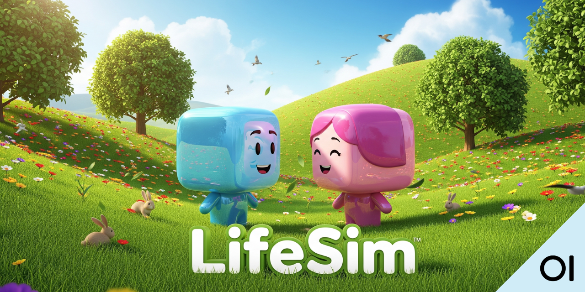

# 🌱 LifeSim – Advanced Life Simulation Game

**LifeSim** is a life simulator inspired by Conway’s *Game of Life*, but with much more realistic and complex rules.  
Agents simulate biological and social behaviors: hunger, aging, illness, conflicts, reproduction, and evolution in a dynamic environment with limited resources.

---

## 🧠 Description

In **LifeSim**, each agent lives in a two-dimensional world full of resources (food) that regenerate over time.  
Agents have age, energy, gender, health status, and complex behaviors:  
they can move, feed, reproduce, get sick, and die.  
The environment regenerates resources over time, while the population evolves and changes according to defined biological and social rules.

You can observe everything in real time through a **pygame** interface, with panels for statistics, a legend, and adjustable parameters.

---

## 🎯 Main Features

- ✅ **Agent-based simulation** with biological and social parameters  
- ✅ **Reproduction** based on age, energy, and encounter probability  
- ✅ **Aging** and mortality linked to age and diseases  
- ✅ **Hunger** and resource consumption, with food regeneration  
- ✅ **Diseases** with probabilities for infection, recovery, and mortality  
- ✅ **Conflicts** between agents (over food or hunger), with a probability of killing  
- ✅ **Real-time visualization** using **pygame**  
- ✅ **Control panel** to adjust simulation parameters live  
- ✅ **Detailed statistics** with mini-graphs showing trends over time  
- ✅ **Optional visual effects** such as a flashing circle at conflict locations  

---

## 🖼️ Interface Preview

Here’s a real example of the **LifeSim** simulation in action:


On the left you can see the statistics panel with real-time graphs,  
in the center the world map with agents (males in cyan, females in magenta, conflicts highlighted),  
and on the right the legend with all active rules.

---

## 🗂️ Project Structure

- **assets/** – Images and graphic resources  
- **src/**  
  - **life_sim/**  
    - `config.py` – Global simulation configuration  
    - `world.py` – World and resource management  
    - `agent.py` – Agent definition and logic  
    - `scheduler.py` – Simulation loop and event handling  
    - `systems/` – Modules for specific aspects (foraging, reproduction, conflict, disease, etc.)  
  - **life_ui/**  
    - `pygame_view.py` – Main graphics loop and UI handling  
    - `renderer.py` – Drawing functions for agents, map, and overlays  
    - `panels.py` – Information and graph panels  
    - `control_panel.py` – Interface for adjusting parameters  
- **tests/** – Unit tests for various components  
- `pyproject.toml` – Poetry project definition  

---

## 🧰 Technologies Used

- Python 3.11  
- [Pygame](https://www.pygame.org/) – Rendering and UI  
- [NumPy](https://numpy.org/) – High-performance numerical calculations  
- [Poetry](https://python-poetry.org/) – Dependency management  
- [Matplotlib](https://matplotlib.org/) – Graphs for panels (optional)  
- Modular structure for easy extension  

---

## 📦 Setup & Launch

Clone the repository:  
```bash
git clone https://github.com/your-username/lifesim.git
cd lifesim
```
Clone the repository:
```bash 
poetry install
```
Run:
```bash 
poetry run python -m life_ui.pygame_view
```